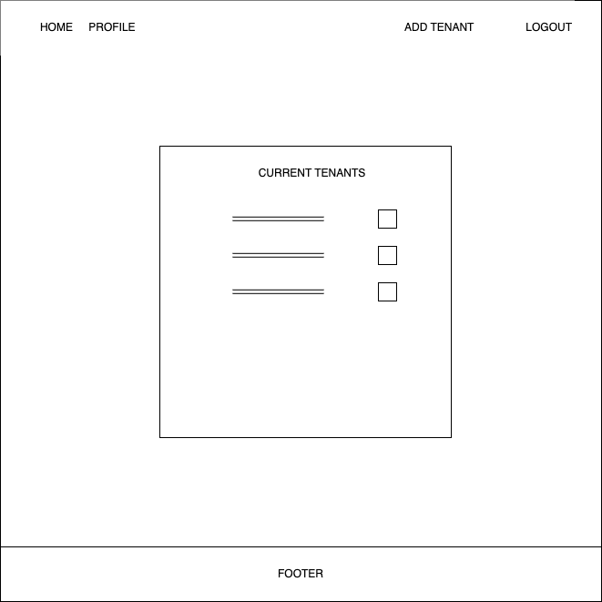
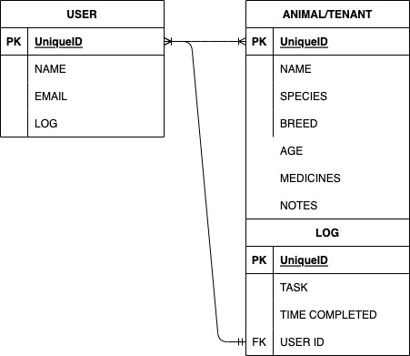

# ShelterHelper: A Comprehensive Task Management Solution for Animal Shelters

ShelterHelper is designed to streamline and simplify daily operations at animal shelters. This intuitive application facilitates task management, keeps track of animal tenants, and ensures accountability among shelter employees. Behind the scenes, ShelterHelper operates with the compassion and care that every animal shelter embodies, making sure no task is overlooked and every animal receives the care it deserves.

## Technologies Used:

Back-end: Express.js, MongoDB
Front-end: EJS
Authentication: Passport.js
Styling: Bootstrap (with custom styling)
Deployment: Heroku

## Wireframes:

  
  
  

  

  
  
  

### Routing

### ERD

  

### MVP Goals

Full CRUD functionality for all relationships contingent on oAuth Authorization.

Polished UI.

### User Stories

#### AAU

I want to be able to add a new dog or cat to the database with all necessary tasks attached to it

I want to see my daily tasks as well as a list of all the animals currently in my shelter

I’d like a visual cue from the homepage to see that one animal has its daily tasks completed

I’d like to know which employee last serviced a tenant and see a log of what was done during the day

### Next Steps/Stretch Goals:

Shift Management: Integration of a scheduling system for users to track and manage their shifts.
Notification System: Instant alerts for critical tasks and reminders for upcoming duties.
Mobile Optimization: Ensuring the app provides a seamless experience across all devices, especially mobiles, for on-the-go updates.
Expanded Animal Profiles: Including detailed medical histories, adoption statuses, and more for each animal.
